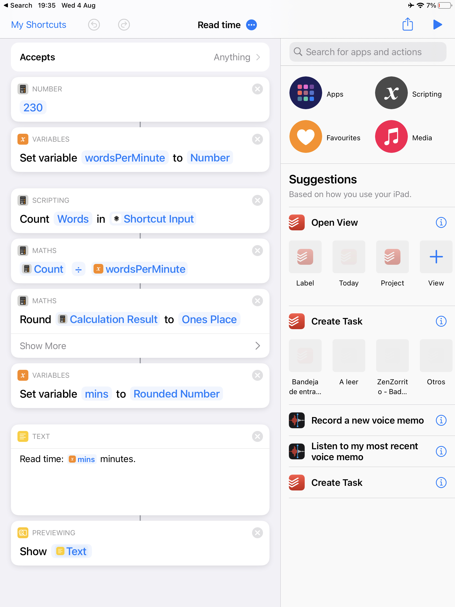
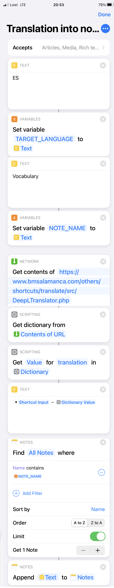

# Shortcuts
Shortcuts to maximize productivity on your favorite iOS devices.

First, [enable shared shortcuts](https://support.apple.com/guide/shortcuts/enable-shared-shortcuts-apdfeb05586f/4.0/ios/14.0) on your device ([ES](https://support.apple.com/es-es/guide/shortcuts/apdfeb05586f/4.0/ios/14.0)).

# Table of contents

1. [Time to read](#time_to_read) ⏳
2. [Tiempo de lectura](#tiempo_de_lectura) ⏳
3. [Save translation into vocabulary note](#translation_to_note) 📝
4. [Guardar traducción en nota de vocabulario](#traduccion_a_nota) 📝

## Time to read ⏳
[Download](https://github.com/mvarona/shortcuts/blob/main/Read%20time.shortcut?raw=true)

Calculate the estimated time to read from any website or text on any app that allows you to share text. Just select it and share it with the shortcut as follows:

## Tiempo de lectura ⏳
[Descargar](https://github.com/mvarona/shortcuts/blob/main/Tiempo%20de%20lectura.shortcut?raw=true)

Calcula el tiempo de lectura estimado de una página Web o texto en cualquier app que permita compartir texto. Tan solo selecciónalo y compártelo con el atajo así:

## Save translation into note 📝
[Download](https://www.icloud.com/shortcuts/84e7665b80d54da0bd572b67a1b3472e)

Save the translation to the language you want from any text into your vocabulary note. Just select it and share it with the shortcut as follows:

## Guardar traducción en nota de vocabulario 📝
[Descargar](https://www.icloud.com/shortcuts/a60076f284ab4ca4a06255fc006552d3)

Guarda la traducción al lenguaje que quieras desde cualquier texto a tu nota de vocabulario. Tan solo selecciónalo y compártelo con el atajo así:

